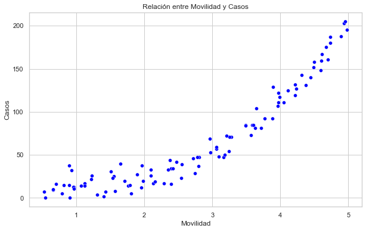
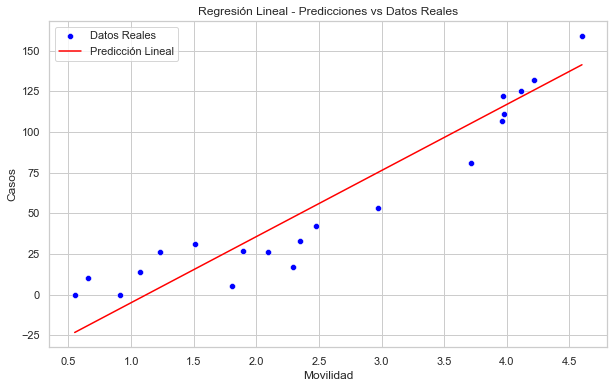
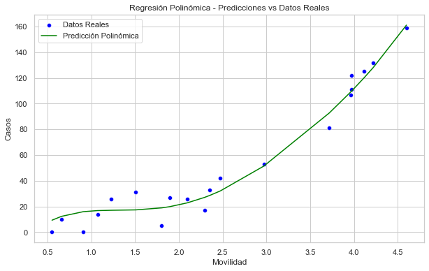
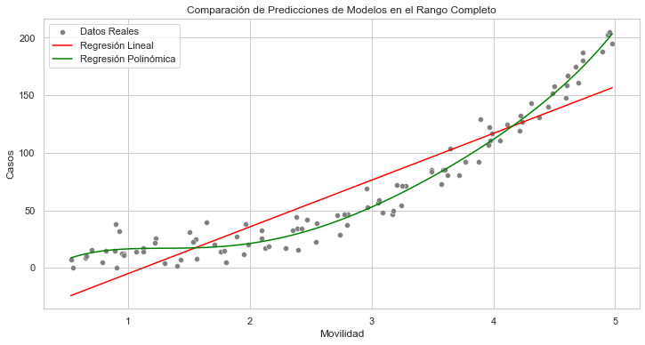

# Análisis de Regresión Polinómica en Python


## Tabla de Contenidos

- [Descripción](#descripción)
- [Tecnologías Utilizadas](#tecnologías-utilizadas)
- [Instalación](#instalación)
- [Uso](#uso)
- [Descripción del Dataset](#descripción-del-dataset)
- [Metodología](#metodología)
  - [1. Creación del Dataset](#1-creación-del-dataset)
  - [2. Preprocesamiento de Datos](#2-preprocesamiento-de-datos)
  - [3. Modelado Inicial](#3-modelado-inicial)
  - [4. Optimización del Modelo Polinómico](#4-optimización-del-modelo-polinómico)
  - [5. Evaluación y Comparación de Modelos](#5-evaluación-y-comparación-de-modelos)
- [Imágenes](#imágenes)
- [Resultados](#resultados)

## Descripción

Este proyecto tiene como objetivo implementar y analizar un modelo de **Regresión Polinómica** utilizando Python 3.12 y Spyder 5. Se abordan todas las etapas del análisis de datos, desde la creación de un dataset simulado con una relación no lineal entre movilidad y casos hasta la evaluación y optimización del modelo mediante técnicas de **Regularización** y **Validación Cruzada**. Además, se generan visualizaciones que ayudan a comprender mejor el comportamiento y rendimiento de los modelos de regresión lineal y polinómica.

## Tecnologías Utilizadas

- **Lenguaje de Programación:** Python 3.12
- **Entorno de Desarrollo:** Spyder 5
- **Librerías Principales:**
  - `numpy`
  - `pandas`
  - `matplotlib`
  - `seaborn`
  - `scikit-learn`

## Instalación

Sigue estos pasos para configurar el entorno de desarrollo y ejecutar el proyecto:

- **Clonar el Repositorio**
    ```bash
    git clone https://github.com/moises60/BreadcrumbsRegresion-polinomica-machine-learning-.git
    ```

- **Acceder a la Carpeta**
    ```bash
    cd BreadcrumbsRegresion-polinomica-machine-learning-
    ```

## Uso

El proyecto consta de dos scripts principales:

- **`crear_dataset.py`:** Este script genera un dataset simulado con una relación no lineal entre la movilidad (**Movilidad**) y el número de casos (**Casos**) de una pandemia.

- **`regresion_polinomica.py`:** Este script carga el dataset generado, realiza el preprocesamiento de datos, ajusta modelos de regresión lineal y polinómica, optimiza el modelo polinómico mediante **GridSearchCV**, y finalmente evalúa y compara ambos modelos. Además, se generan visualizaciones que ilustran el desempeño de cada modelo.

## Descripción del Dataset

El dataset simula información sobre la **Movilidad** de una población y el correspondiente número de **Casos** registrados. Las variables incluidas son:

- **Movilidad:** Índice que representa la movilidad de la población (rango entre 0.5 y 5.0), generado de manera que tenga una relación no lineal con los casos.
  
- **Casos:** Número de casos registrados (variable dependiente), calculado en función de la movilidad con una relación cúbica y un componente de ruido aleatorio.

## Metodología

### 1. Creación del Dataset

Se generó un dataset con 100 muestras donde cada observación representa un punto de datos con las siguientes características:

- **Movilidad:** Valores generados linealmente entre 0.5 y 5.0 con adición de ruido para simular variabilidad real.
  
- **Casos:** Calculados utilizando una relación cúbica con **Movilidad**:
  
  \[
  \text{Casos} = a \times (\text{Movilidad})^3 + b \times (\text{Movilidad})^2 + c \times (\text{Movilidad}) + d + \text{ruido}
  \]
  
  Donde los coeficientes `a`, `b`, `c`, y `d` fueron seleccionados para crear una relación no lineal evidente.

### 2. Preprocesamiento de Datos

- **Escalado de Características:** Se utilizó `StandardScaler` para normalizar la variable **Movilidad**, lo que es especialmente útil para modelos que dependen de la escala de las características.

- **División del Dataset:** Se dividió el dataset en conjuntos de entrenamiento (80%) y prueba (20%) para evaluar el rendimiento de los modelos.

### 3. Modelado Inicial

- **Regresión Lineal:** Se ajustó un modelo de regresión lineal simple utilizando **Movilidad** como variable independiente para establecer una línea base de comparación.

### 4. Optimización del Modelo Polinómico

- **Regresión Polinómica:** Se implementó un modelo de regresión polinómica utilizando un **Pipeline** que incluye `PolynomialFeatures` (grado 2, 3 y 4) y `Ridge Regression` con regularización.

- **Optimización con GridSearchCV:** Se utilizó `GridSearchCV` para encontrar los mejores parámetros del modelo polinómico, explorando diferentes grados de polinomio y valores de `alpha` para la regularización.

### 5. Evaluación y Comparación de Modelos

- **Métricas de Evaluación:** Se utilizaron **MAE (Error Absoluto Medio)**, **MSE (Error Cuadrático Medio)** y **R² Score** para evaluar el rendimiento de ambos modelos.

- **Visualizaciones:**
  - **Relación entre Movilidad y Casos:** Gráfico de dispersión que muestra la distribución de los datos.
  - **Predicciones vs Datos Reales:** Comparación visual de las predicciones de cada modelo frente a los valores reales.
  - **Comparativa de Métricas:** Gráficos de barras que muestran las métricas de desempeño de cada modelo.
  - **Residuales:** Análisis de los residuales para verificar la calidad del ajuste.

## Imágenes









## Resultados

| Modelo     | MAE   | MSE    | R² Score |
|------------|-------|--------|----------|
| Lineal     | 15.42 | 305.14 | 0.8780   |
| Polinómico | 7.08  | 72.02  | 0.9712   |

**Interpretación:**
- **Modelo Polinómico** supera al **Modelo Lineal** en todas las métricas, indicando un mejor ajuste a la relación no lineal entre **Movilidad** y **Casos**.

